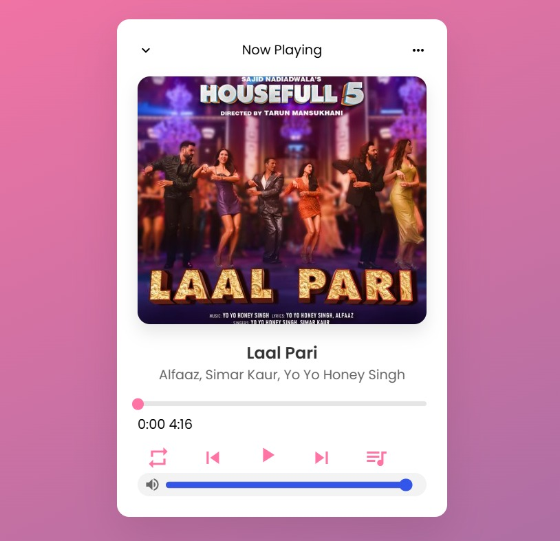
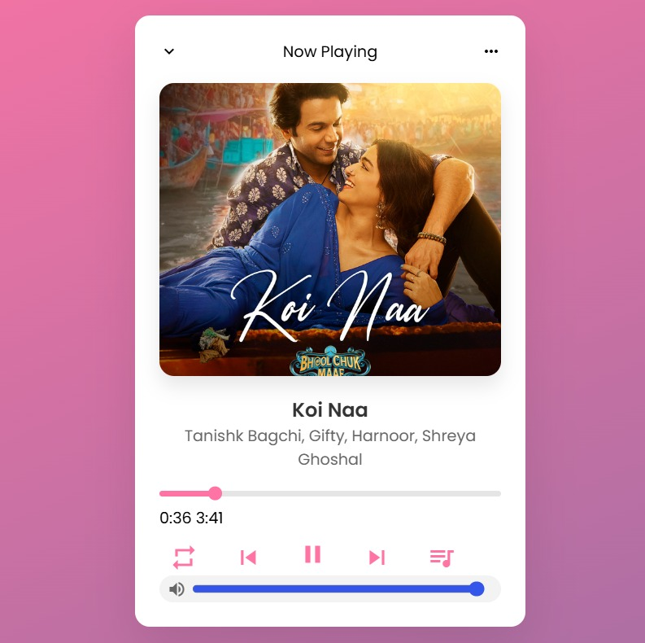
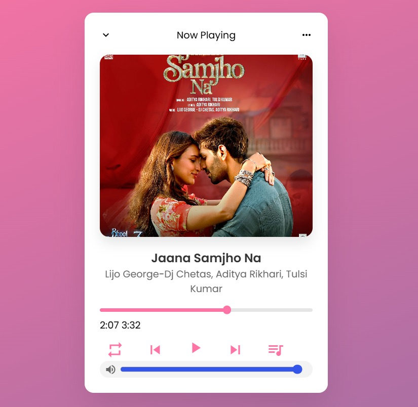
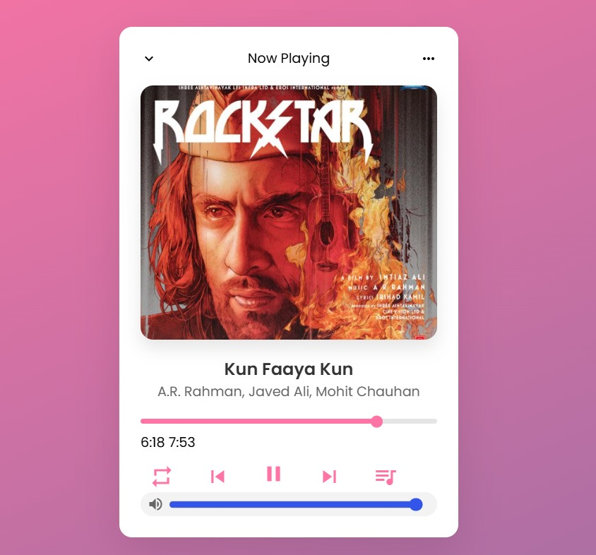
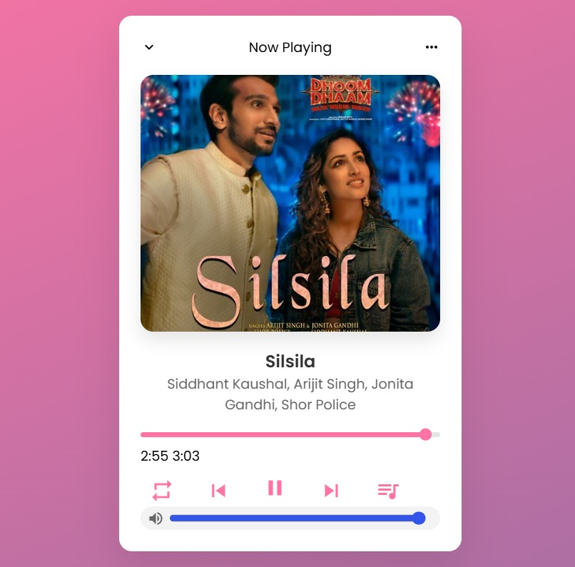

# 🎵 Music Player

A **full-stack music player application** built with **Node.js** for the backend and modern web technologies for the frontend.  
It allows users to **play, pause, and manage music tracks** with a responsive and interactive interface.

---

## 🚀 Features
- ▶ **Play**, ⏸ **Pause**, ⏭ **Skip** tracks
- 📃 Playlist management
- 📱 Responsive design for desktop and mobile
- ⚡ Backend powered by **Express.js**
- 🔗 API integration for music data handling
- 🎧 Smooth audio playback with **HTML5 Audio API**

---

## 🛠 Tech Stack
**Frontend:** HTML, CSS, JavaScript  
**Backend:** Node.js, Express.js  
**Package Management:** npm  

---

## 📂 Project Structure
Music-Player/

├── backend/ # Node.js server, APIs, and music data handling

└── frontend/ # User interface and player controls

---

## 📌 How to Start After Downloading the Repository

### 1️⃣ Frontend (Run Locally)
1. Navigate to the frontend folder.
2. Open Visual Studio Code and open the index.html file.
3. Make sure the Live Server extension is installed in VS Code.
4. Right-click anywhere inside index.html → select “Open with Live Server”.
5. 🎉 Enjoy the music player interface.

---

### 2️⃣ Backend (Run in VS Code Terminal)
1. Open the `Music-Player` folder in **Visual Studio Code**.
2. In VS Code Explorer, click on `backend/server.js` so it’s open.
3. Open the integrated terminal (**View → Terminal** or `Ctrl + ~`).
4. Select Command Prompt.
5. Navigate to the backend folder:
   ```bash
   cd backend
6. Then, navigate to the server.js folder:
   ```bash
   cd server.js
8. Install dependencies:
   ```bash
   npm install
10. Start the server:
    ```bash
    npm start
12. The backend API will now be running locally.

## 📸 Screenshots
 





